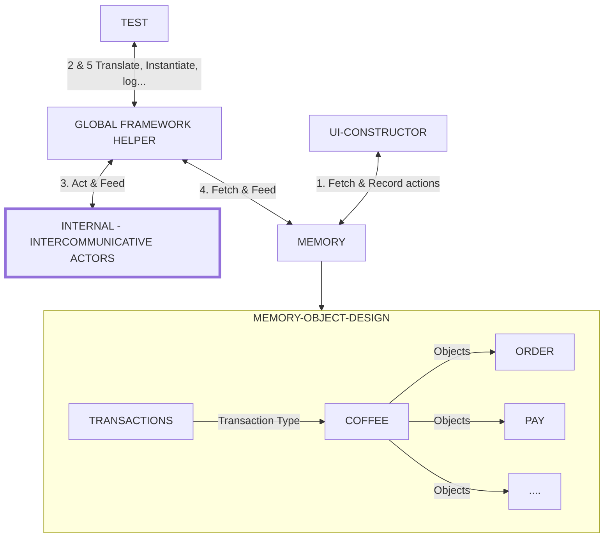

# Testing with moduled test actions

## Outline

-   [Architecture](#architecture)
-   [Test Action Objects](#test-action-objects)
-   [Key takeaways](#key-takeaways)
-   [Test Constrictor UI](#test-constructor-ui)

The approach here uses object methods to define test steps, which are exported in an array of instructions that can be read by any test executor. The goal is to read and execute each step in sequence while utilizing local storage to manage whatever flow dependency might exist between steps.

## The problems with testing we are trying to solve

-   In a world with lots of unique investigative scenarios, modular tests means faster testing since it builds its own scenarios.
-   If you did not rewrite the whole app, why retest the whole platform?
-   Lets solve bundled test cases: create payment test is not just creating payment. But where are the AC assertions.
-   Test pyramid addresses this by creating 3 main test groups
    -   Unit, Integration, E2E. But then it splits them
-   I know this sounds like a lot, but if you think about it, in a few years from now... if you don't do this, you'll still hate testing. Remember that E2E does not mean long boring scripts, it simply means from one end to another.

### Existing solutions

The approach has been around for a while but mostly geared towards UI testing and however the process involves writing out steps. Taking it further beyond scenario has been difficult because of the difficulty in writing a tool for all types of business logic.

-   Gherkin
-   [Codecept](https://codecept.io/quickstart/)

## A new way to approach this

Analyze and modularize every primary action into test objects.

1. #### Dynamic Tests

Our current approach is to write e2e tests that fit in as much as possible in one block. We pay, then capture, then refund then check AC then Hub, for each test but shift a tiny case in-between each

-   Have you ever commented out parts of a test cus; who cares, we just want to debug a particular part?
-   One approach is to use test runners to execute global actions not steps.

```javascript
test('Create payment', () => {
    //create a valid payment
})
//but this is silly and wasteful, so lets move on.
```

2. #### Test Action Objects
    Building on the earlier idea however, we know what we need done, what if we have on test that can do all that.

-   We start by identifying and building our test actions into into individual procedures.
-   Most test suites typically have `page-login, add-to-cart, call-an-endpoint, ...` depending on the product
    -   Each case then becomes an identifiable test action

This is already a familiar approach, but tests actions still are localized to each test block because we never solved the session problem. `we've been told to avoid interdependent tests`

-   What if we did, and every action knows just what to get for its process.

```javascript
//old
test('Create payment', () => {
    //this test can:
    //create valid payment
    //capture the said created payment
    //...
})
```

```javascript
//new
test('Create payment', () => {
    //this test can:
    //go get each action
    //for each action, run related method
})
//we have to introduce 2 new things here
```

-   Data storage: Each action uses a global storage for the resolution of its process, this storage also ensure we can pass dependencies between test actions
-   Injecting each action is not hardcoded, rather can be dynamically created via a UI or array file.

3. #### Test Constructor UI

Simplifying the test setup and execution steps only ensures we can run tests in any given order. The above approach however only abstracts the test steps, to simplify the setup of instructions for our runner, we use a simple Node-Express app which reads the available test actions and constructs a set of instructions suitable for parsing.

-   Node App UI
    -   Reads and offers a form containing all available array of actions per project
    -   Saves user selection to file which is being read by the test runner.

### What we've done here is completely set the tests free.

## Architecture

-   Test UI : Creates and customizes a sequence of supported actions
-   Global helpers : Translators and other main actors; loggers... : `objects methods or classes`
    -   Actor : Executes given test actions
    -   Translator : Changes tags to predefined methods.
    -   Memory
        -   Sorts and retrieves current test session dependencies
        -   Stores an array of instructions
-   Test actions: Methods containing action organizers : `objects`
-   A test block : Parse through each action with given command flow : `mocha`

### Sample Flow

-   The UI reads and provides a set of test actions available
    -   Creates a simple array of tags with selections
-   Using the global helper
    -   The test block reads a set of instruction tags from the UI array file
    -   Calls the translator to parse which action to perform, defined as methods
    -   The actor then calls the session tree to find data related to completing its action
        -   Then executes and if necessary, exports the result back to memory node.



#### Key takeaways

-   Each step is its own procedure that either resolves a true or catastrophic false
    -   We don't have to worry about interdependent tests, if the test fails because data is not available, then we have found our bug.
-   The UI is built on available nodes in each action tree.
    -   Since each action can be anything, we can use functions that take args
