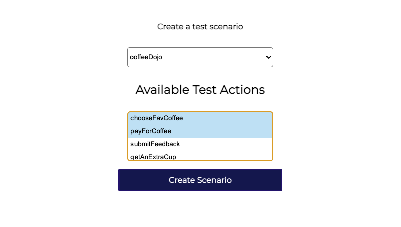
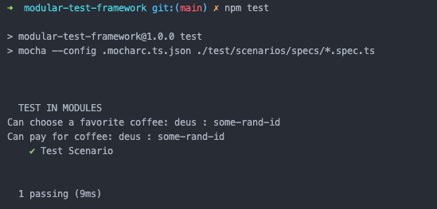

# A Modular Test Framework

Abstracted instruction based test action methods which can be injected to test runners using local file system and session management.

#### In Abstract

There are a number of UI test frameworks that attempts to simplify the process of creating test scenarios because the faster tests directly interpret to a faster delivery but most are either geared towards UI applications or rather still require writing a good amount of scenario steps. This framework helps achieve a low code test workflow by moving all your test actions into a defined set of instructions that can be executed by any test runner.

-   A test lego that actually works

---

## Resources

-   Complete approach documentation [doc.md](doc.md)
-   101 on Medium Post

## Stack

-   [Typescript](https://github.com/microsoft/TypeScript)
-   [Mocha](https://github.com/mochajs/mocha)
-   [Express JS](https://github.com/expressjs/express)
-   [Mustache](https://github.com/janl/mustache.js/)

## Setup

-   Clone project
-   Install package dependencies from the root directory `npm install`
-   Start the UI app with `npm start`
    -   Configure a scenario
-   Run tests with command provided in UI or with `npm run test`

## Code samples

### Define and export your test actions methods

```javascript
{
    loginToPage: async (request: Record<string, any>) => {
        //capture payment process...

        //return responses to test session
        return {
            id: uniqueActionId,
            metaData: {}
            message: 'Page login successful'
        }
    }
}
```

### Inject your action names into a dynamic storage

```json
{
    "your_app_name": ["loginToPage"]
}
```

### A simple test flow using the approach, executes each action in sequence

```javascript
test(`Moduled`, async () => {
    //a UI selected array list of preferred actions
    const actions = helper.getActions('your_app_name')

    for (const element of actions) {
        //parse each action array as you defined test methods
        const currentAction = helper.translateAction(element)
        //fetch existing test session data
        const attributes = helper.readTransaction()
        //execute each action
        const { functionMessage, id, status, appStep } = await helper.executeAction(attributes, currentAction)
        //export resolutions to test session
        helper.writeTransaction({ id, status, appStep })
        //...other extensions: global assertions, reporting...
    }
})
```

### setup app ui



### sample test result



## Credits

-   Icons [Module icons created by Freepik - Flaticon](https://www.flaticon.com/free-icons/module")
-   Pictures [Unsplash](https://unsplash.com/s/photos/order?utm_source=unsplash&utm_medium=referral&utm_content=creditCopyText)
