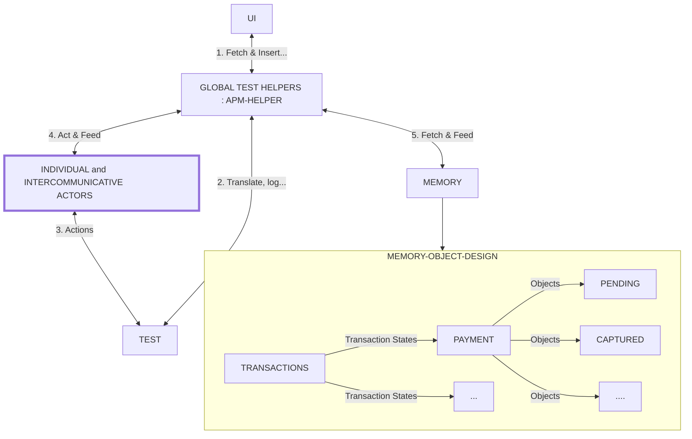

# Testing with moduled test actions

There is already enough code in here to piss you off so I'd not be writing so much cus I hate double wammys too. So I'll just be bulllet pointing it all but you cannot avoid my side remarks; sad you.

This is up for review, while the code here works in practice, there might be parts of the approach that require updated design.

## The problems with testing we are trying to solve

-   In a world with lots of unique investigative scenarios, modular tests means faster testing since it builds its own scenarios.
-   If you did not rewrite the whole app, why retest the whole platform?
-   Lets solve bundled test cases: create payment test is not just creating payment. But where are the AC assertions.
-   Test pyramid addresses this by creating 3 main test groups
    -   Unit, Integration, E2E. But then it splits them
-   I know this sounds like a lot, but if you think about it, in a few years from now... if you don't do this, you'll still hate testing. Remember that E2E does not mean long boring scripts, it simply means from one end to another.

### Existing solutions

The approach has been around for a while but mostly geared towards UI testing and however the process involves writing out steps. Taking it further beyond scenario has been difficult because of the difficulty in writing a tool for all types of business logic.

-   Gherkin
-   [Codecept](https://codecept.io/quickstart/)

## A new way to approach this

Analyze and modularize every primary action into test objects.

1. #### Dynamic Tests

Our current approach is to write e2e tests that fit in as much as possible in one block. We pay, then capture, then refund then check AC then Hub, for each test but shift a tiny case in-between each

-   Have you ever commented out parts of a test cus; who cares, we just want to debug a particular part?
-   One approach is to use test runners to execute global actions not steps.

```javascript
test('Create payment', () => {
    //create a valid payment
})
//but this is silly and wasteful, so lets move on.
```

2. #### Test Action Objects
    Building on the earlier idea however, we know what we need done, what if we have on test that can do all that.

-   We start by identifying and building our test actions into into individual procedures.
-   We typically have `@create @capture @refund @ac @hub @webhook @dashboard` and each of these may or not have nested categories. Refunds for example has full or partial.
    -   Each case then becomes an action identifiable with a tag initiator.

This is already a familiar approach, but tests actions still are localized because we never solved the session problem. `we've been told to avoid interdependent tests`

-   What if we did, and every action knows just what to get for its process.

```javascript
test('Create payment', () => {
    //this test can:
    //create valid payment
    //capture the said created payment
    //...
})
//but we introduce 2 new things here
```

-   Data storage: Each action uses a global storage for the resolution of its process
-   Injecting each action is not hardcoded, rather can be dynamically created via a UI or array file.

3. #### A chefs UI

Tests are nothing without being repeatedly executed, executed tests are nothing without being reported. None of these are anything without a UI to manage it.

-   Now we have a warehouse of actions, we can call each one according to our preferences.

### What we've done here is completely set the tests free.

## Architecture

-   Test UI : Creates and customizes a sequence of supported actions
-   Global helpers : Api requests and other main actors; loggers... : `objects`
    -   Actor : Executes given test actions
    -   Translator : Changes tags to predefined objects.
    -   Memory
        -   Sorts and retrieves current test session dependencies
        -   Stores an array of instructions
-   Test actions: Methods containing action organizers : `objects`
-   A test block : Test execution : `mocha`

### Sample Flow

-   The UI reads and provides a set of actors available
    -   Creates a simple array of tags with selections
-   Th test block reads a set of instruction tags from the UI array file
-   Calls the translator to parse which action to perform, defined as methods
-   The actor then calls the session tree to find data related to completing its action
    -   Then executes and if necessary, exports the result back to memory node.



#### Key takeaways

-   Each step is its own procedure that either resolves a true or catastrophic false
    -   We don't have to worry about interdependent tests, if the test fails because data is not available, then we have found our bug.
-   The UI is built on available nodes in each action tree.
    -   Since each action can be anything, we can use functions that take args

### Lets see this in action

-   Demo is an abstract from the current SEPA tests, we built on top of that only. What we need/have:
    -   A collection of test helper objects, smart enough to do stuff. Sepa
    -   A digital file manipulation function to keep sessions in place. Sepa
    -   A translator sample: Assertion.
-   One thing left: The UI. Node-Express

I should say that the reason why I did this is not really to show you a fancy click buttons and select fields in tests but to get you thinking about tests in a different way... To get you to see tests not just as this blob long script of things the CPU needs to do duh but a living entity that can be alive and change to the day and mood of the software that; thanks to you all is ever evolving
